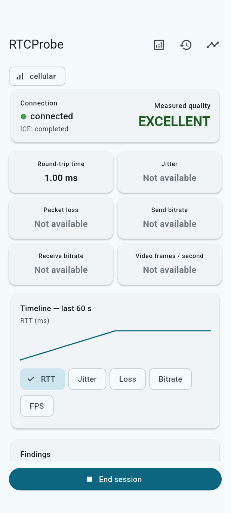

# RTCProbe

**Explain WebRTC degradation from measured statistics, with missing evidence kept visible.**

A peer connection can report “connected” while media stutters. Cumulative counters alone are also easy to misread: a stream reset can look like a bitrate spike, missing RTP fields can look like zero loss, and a single bad sample can become an overconfident diagnosis.

RTCProbe turns native WebRTC reports into normalized metrics, interval deltas and sustained findings. Its current probe and mirror run on the same device, making the diagnostics workflow reproducible without a signaling service. **This is a local WebRTC-stack lab, not an internet-quality test.**

<p align="center">
  
</p>

*Existing Android integration captures, animated as five screens—not a continuous recording. The run uses real transport and shows interruption/restart; it contains no camera-media or WAN performance evidence. Playback duration does not represent failure-detection timing.*

## From reports to an explanation

```text
Local probe ↔ local mirror (real native ICE / DTLS, optional RTP)
    → getStats at 1 Hz → normalize fields and units
    → counter deltas with identity/reset checks
    → current quality + sustained diagnostic conditions
    → bounded timeline, event history and whole-session summary
```

Native connection callbacks establish state. Dart adapters hide plugin report types; widgets consume domain measurements. The selected ICE pair supplies transport RTT, with remote RTCP RTT fallback where available. Native Kotlin/Swift bridges add network context separately: the device's default network context is not proof of the selected ICE path. See [architecture](docs/architecture.md) and [platform boundaries](docs/platform-bridge.md).

## Measurement decisions that prevent misleading charts

| Boundary | Implemented treatment |
|---|---|
| First sample or invalid interval | Rates remain unavailable until comparable counters exist |
| Stream identity change or decreasing counters | Do not turn resets into artificial bitrate/loss values |
| Absent/non-finite fields | Keep null and display “Not available” |
| Bitrate | Delta bytes × 8 / elapsed milliseconds, in kbps |
| Interval inbound loss | Delta lost / (delta received + delta lost), across measurable streams |
| Session loss summary | Mean of available interval percentages, not a packet-weighted whole-session loss ratio |

FPS uses the reported rate or a frame-count delta fallback. Data-channel counters stay separate from RTP media metrics. The supported shape is one audio/video stream per direction, not simulcast or multi-peer aggregation. Source: [metrics calculator](lib/rtc/metrics_calculator.dart); [field mappings](docs/stats.md).

## Quality changes and findings have different timing

Quality uses the worst available RTT, jitter or interval-loss classification; no inputs yields Unknown. Native disconnection/failure overrides live quality to Critical. Thresholds are project defaults, not universal call-quality standards.

Findings normally require three consecutive samples, with three healthy samples to clear; video-frame stalls require five. Missing measurements reset the streak rather than manufacturing evidence. Findings expose observed values and possible impact, not a certain network root cause. See [diagnostic engine](lib/rtc/diagnostic_engine.dart), [thresholds](docs/qos.md) and [rules](docs/diagnostics.md).

Sampling avoids overlapping requests. Charts retain 600 samples and show the last 60 seconds by default; event history retains 200 entries. Whole-session aggregates continue independently of the chart window. These are resource bounds, not measured CPU/battery results.

## Reproduce the visible failure

```sh
flutter pub get
flutter run
```

Choose Transport-only, Start and wait for Connected. Inspect details, disconnect the mirror and wait for the native interruption finding. Restart creates a fresh session; End keeps a summary in memory.

In Capture mode, grant camera/microphone access and inspect actual media statistics. Encoder caps and video pause modify native behavior, but a cap does not guarantee a finding and disabled tracks may send black frames. Loopback can survive airplane mode; it cannot establish WAN loss or congestion. See [demo steps](docs/demo.md).

## Evidence already present—and missing

The [verification record](docs/verification.md) reports 28 passing unit/widget tests, successful Android/iOS-simulator debug builds and native transport/dashboard integration on Android A063 and an iPhone simulator. Tests cover resets, missing fields, thresholds, sustained findings, bounded history, lifecycle handling and fresh-session restart. These are recorded results, not checks rerun in this documentation pass.

```sh
flutter test
flutter analyze
flutter test integration_test/local_session_test.dart -d DEVICE_ID
flutter drive --driver=test_driver/integration_driver.dart --target=integration_test/dashboard_session_test.dart -d DEVICE_ID
```

Run native targets sequentially. Camera/microphone capture, real media RTT/jitter/loss/bitrate/FPS, encoder controls, physical iOS behavior and actual OS backgrounding during capture remain unvalidated. A capture-enabled session with its summary is the next useful visual evidence.

## Scope and privacy

There is no remote peer, application backend, STUN/TURN configuration, analytics or media persistence. Diagnostics remain in memory. End/background releases session resources through lifecycle handling. The source review is not a packet-capture audit or proof of every device's native cleanup behavior. See [privacy](docs/privacy.md) and [lifecycle](docs/lifecycle.md).

A controlled remote peer, packet-weighted session loss and release resource profiling remain future work. Native stats and encoder support vary by platform; the pinned plugin's future toolchain compatibility is an existing maintenance concern documented in verification.
